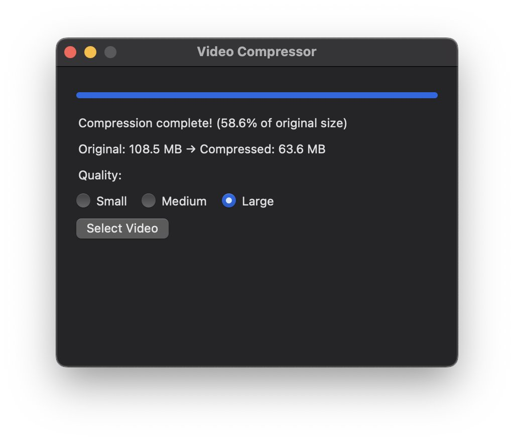

# macOS Screen Recording Compressor



A simple macOS application that compresses screen recordings using FFmpeg with GPU acceleration.

## Prerequisites

1. Xcode Command Line Tools
2. FFmpeg (with VideoToolbox support)
3. Make

## Installation

1. Install FFmpeg with VideoToolbox support:
```bash
brew install ffmpeg
```

2. Build the application using Make:
```bash
make
```

Or manually:
```bash
clang -framework Cocoa -I/usr/local/include -L/usr/local/lib -o VideoCompressor main.m -lavcodec -lavformat -lavutil -lavdevice
```

## Usage

1. Run the application:
```bash
./VideoCompressor
```

2. Click "Select Video" to choose a screen recording
3. The application will compress the video using GPU acceleration
4. The compressed file will be saved in the same location with ".compressed" appended to the filename

## Features

- Simple GUI interface
- GPU-accelerated compression using VideoToolbox
- Progress bar showing compression status
- Preserves original video quality while reducing file size
- Supports MP4 and MOV formats

## Notes

- The application uses FFmpeg's h264_videotoolbox encoder for GPU acceleration
- Default bitrate is set to 5Mbps for good quality/size balance
- Audio is copied without re-encoding to maintain quality

## Development

To clean build artifacts:
```bash
make clean
``` # macos-ffmpeg-compress-app
